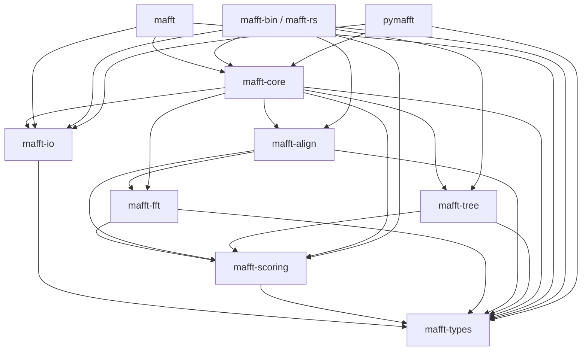

# Workspace overview

rust-MAFFT is a single Cargo workspace with 12 crates. 10 are
publishable (crates.io); 2 stay internal.

## The crates

```
crates/
├── mafft-c-bindings/   ← INTERNAL  : FFI shim to MAFFT C source (cross-validation only)
├── mafft-sys/          ← published : reserved-name stub (0.0.1) for future real FFI bindings
├── mafft-types/        ← published : Sequence, SequenceSet, scoring models, segments
├── mafft-io/           ← published : FASTA, hat2, localhom, Clustal, PHYLIP I/O
├── mafft-scoring/      ← published : BLOSUM, JTT, TM matrices, gap penalties
├── mafft-fft/          ← published : hand-ported Cooley-Tukey FFT, bit-for-bit C-compat
├── mafft-align/        ← published : pairwise + profile DP (NW, SW, generalized affine)
├── mafft-tree/         ← published : NJ, UPGMA, PartTree, memsavetree
├── mafft-core/         ← published : MafftEngine, progressive alignment, refinement, --add
├── mafft/              ← published : ergonomic top-level — `cargo add mafft`
├── mafft-bin/          ← published : the `mafft-rs` CLI (`cargo install mafft-rs`)
└── pymafft/            ← INTERNAL  : Python bindings via PyO3 (shipped as a wheel)
```

## Dependency graph



## Why split into so many crates

- **Compile time.** Most callers only need the engine; pulling
  `mafft-fft`'s FFT machinery for an L-INS-i workflow is wasted work.
  Splitting gives `cargo` precise rebuild boundaries.
- **API surface.** Each crate is small enough to read in one sitting.
  `mafft-scoring` is pure: matrices in, scores out. `mafft-fft` is the
  numerically-fussy bit, isolated.
- **Independent versioning.** Once we hit 1.0, scoring matrices can
  evolve at their own pace. The top-level `mafft` re-export shields
  callers from sub-crate version churn.
- **Publishability.** `pymafft` ships through PyPI, `mafft-bin` through
  crates.io. `mafft-c-bindings` (which compiles MAFFT's C source from
  the git submodule) can't be published as-is and is correctly marked
  `publish = false`.

## Two ergonomic entry points

- **`cargo add mafft`** — most users. `mafft` re-exports the engine,
  types, and I/O. `use mafft::*` is enough for the majority of work.
- **`cargo install mafft-rs`** — for the CLI binary on `$PATH`.

For finer control, depend on individual sub-crates (`mafft-core`,
`mafft-fft`, etc.) directly.

## Internal crates

### `mafft-c-bindings` (`publish = false`)

Compiles MAFFT's C source (`mafft-upstream/core/*.c`) into a static lib
and exposes raw `unsafe extern "C"` bindings. Used by the
[cross-validation tests](cross-validation.md) — never at runtime. Can't
be published because the C source lives in a git submodule outside the
crate directory.

### `pymafft` (`publish = false` on crates.io, published as a wheel on PyPI)

The PyO3 binding crate. Cargo doesn't publish it; `maturin` packages
it as a Python wheel. The wheel also embeds the `mafft-rs` binary so
`pip install pymafft` puts the CLI on `$PATH`.

## Release flow

A single GitHub release fans out to four channels (see the
[Contributing guide](../contributing/index.md#release-process) for the
button-press procedure):

```
git tag v0.X.Y && gh release create v0.X.Y
                          │
        ┌─────────────────┼──────────────────┐
        │                 │                  │
   release.yml       python.yml       cargo-publish.yml
   (5 binaries        (25 wheels +      (10 crates on
    on GH release      sdist on          crates.io in
    page)              PyPI)             dep order)
```
