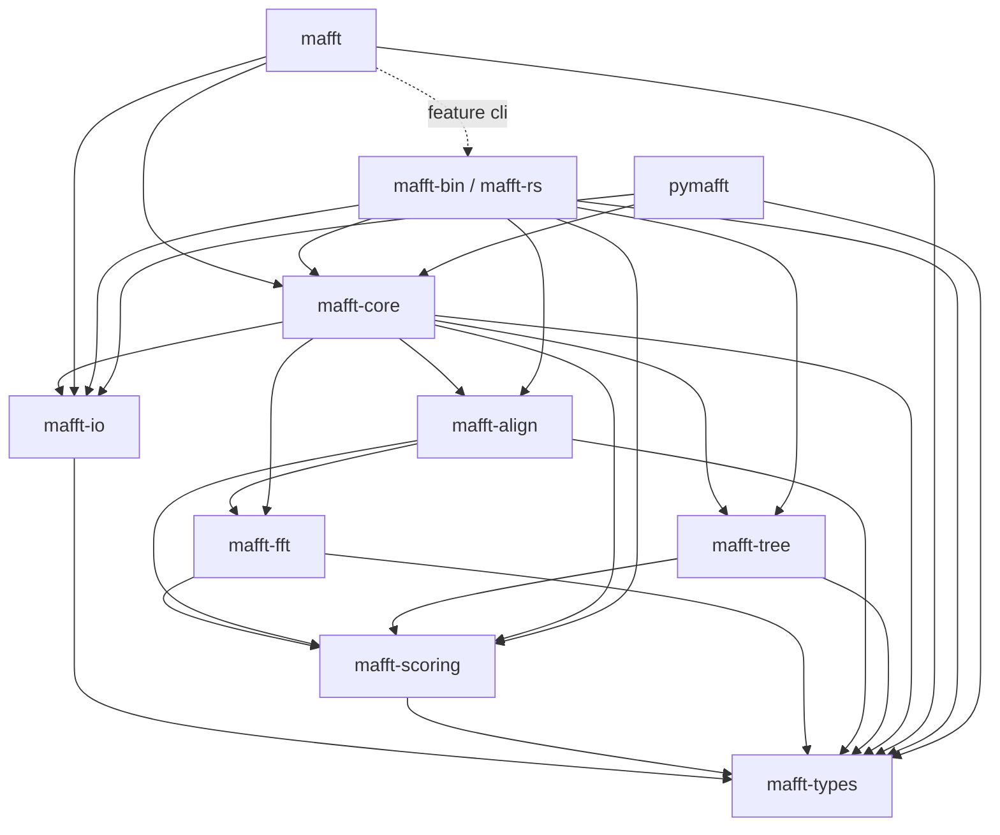

# Workspace overview

rust-MAFFT is a single Cargo workspace with 12 crates. 10 are
publishable (crates.io); 2 stay internal.

## The crates

```
crates/
├── mafft-c-bindings/   ← INTERNAL  : FFI shim to MAFFT C source (cross-validation only)
├── mafft-sys/          ← published : reserved-name stub (0.0.1) for future real FFI bindings
├── mafft-types/        ← published : Sequence, SequenceSet, scoring models, segments
├── mafft-io/           ← published : FASTA, hat2, localhom, Clustal, PHYLIP I/O
├── mafft-scoring/      ← published : BLOSUM, JTT, TM matrices, gap penalties
├── mafft-fft/          ← published : hand-ported Cooley-Tukey FFT, bit-for-bit C-compat
├── mafft-align/        ← published : pairwise + profile DP (NW, SW, generalized affine)
├── mafft-tree/         ← published : NJ, UPGMA, PartTree, memsavetree
├── mafft-core/         ← published : MafftEngine, progressive alignment, refinement, --add
├── mafft/              ← published : ergonomic top-level — `cargo add mafft`
├── mafft-bin/          ← published : the `mafft-rs` CLI (`cargo install mafft-rs`)
└── pymafft/            ← INTERNAL  : Python bindings via PyO3 (shipped as a wheel)
```

## Dependency graph



## Why split into so many crates

- **Compile time.** Most callers only need the engine; pulling
  `mafft-fft`'s FFT machinery for an L-INS-i workflow is wasted work.
  Splitting gives `cargo` precise rebuild boundaries.
- **API surface.** Each crate is small enough to read in one sitting.
  `mafft-scoring` is pure: matrices in, scores out. `mafft-fft` is the
  numerically-fussy bit, isolated.
- **Independent versioning.** Once we hit 1.0, scoring matrices can
  evolve at their own pace. The top-level `mafft` re-export shields
  callers from sub-crate version churn.
- **Publishability.** `pymafft` ships through PyPI, `mafft-bin` through
  crates.io. `mafft-c-bindings` (which compiles MAFFT's C source from
  the git submodule) can't be published as-is and is correctly marked
  `publish = false`.

## Three ergonomic entry points

- **`cargo add mafft`** — most users. `mafft` re-exports the engine,
  types, and I/O. `use mafft::*` is enough for the majority of work.
- **`cargo install mafft-rs`** — for the CLI binary on `$PATH`.
- **`cargo add mafft-rs`** (or `mafft` with `features = ["cli"]`) — to
  embed the *command line's* behaviour in a program. See below.

For finer control, depend on individual sub-crates (`mafft-core`,
`mafft-fft`, etc.) directly.

## Embedding the CLI's flag layer

`MafftEngine::align` takes an `AlignmentMode`. The command line does more
than call it: `--auto` *chooses* the mode from sequence count and length,
`--adjustdirection` runs strand detection first, `--nuc` / `--amino` force
the type and the residue case fold, `--reorder` changes the output order.
That flag → behaviour layer lives in `mafft-bin` (`crates/mafft-bin/src/lib.rs`),
and a program that re-derived any of it would quietly drift from C MAFFT.
The `mafft-rs` library target therefore exposes it directly, argv in:

| Entry point | Input | Output |
|-------------|-------|--------|
| `run_from(argv, &mut out)` | `INPUT` file / stdin, as on the command line | formatted text (`--format`) into `out` |
| `run_from_with_progress(argv, &mut out, &sink)` | same | same, progress lines to `sink` |
| `run_from_seqs(argv, &SequenceSet, &sink)` | sequences already in memory | `MultipleAlignment` (names + rows by value) |
| `Mafft::new()…run()` / `.run_to_vec()` / `.run_seqs(&set)` | typed builder over the above | as above |

All of them parse `argv` with the same clap definition and run the same
stages — `parse_argv → preflight → (read_input | prepare_in_memory) →
align_prepared → write_alignment` — so `run_from_seqs` returns exactly the
rows `run_from` would print, including `--reorder`'s order and
`--adjustdirection`'s `_R_` name prefixes. Every failure is a `MafftError`
carrying the CLI's exit code and message.

```rust,no_run
use mafft_rs::{run_from_seqs, SilentProgress, Sequence, SequenceSet, SeqType};

let input = SequenceSet {
    sequences: vec![
        Sequence { name: "a".into(), data: b"atggctagcttggacc".to_vec() },
        Sequence { name: "b".into(), data: b"atggctagcttgcacc".to_vec() },
    ],
    seq_type: SeqType::Dna,
};
// The same flags `mafft --auto --adjustdirection --thread 1 --nuc FILE`
// would take, minus FILE: the sequences are already here.
let msa = run_from_seqs(
    ["mafft", "--auto", "--adjustdirection", "--thread", "1", "--nuc"],
    &input,
    &SilentProgress,
)?;
for (name, row) in msa.names.iter().zip(&msa.sequences) {
    println!(">{name}\n{}", std::str::from_utf8(row).unwrap());
}
# Ok::<(), mafft_rs::MafftError>(())
```

Copies on this path: the input is borrowed and handed to the engine as-is
when it is already canonical (the reader's residue filter, the case
convention for its type, a declared `seq_type`); otherwise one normalised
copy is made. Flags that rewrite the input (`--adjustdirection`, `--seed`,
`--anysymbol`) copy once more, exactly as on the file path. The returned
rows are moved out of the engine's result, not copied.

## Internal crates

### `mafft-c-bindings` (`publish = false`)

Compiles MAFFT's C source (`mafft-upstream/core/*.c`) into a static lib
and exposes raw `unsafe extern "C"` bindings. Used by the
[cross-validation tests](cross-validation.md) — never at runtime. Can't
be published because the C source lives in a git submodule outside the
crate directory.

### `pymafft` (`publish = false` on crates.io, published as a wheel on PyPI)

The PyO3 binding crate. Cargo doesn't publish it; `maturin` packages
it as a Python wheel. The wheel also embeds the `mafft-rs` binary so
`pip install pymafft` puts the CLI on `$PATH`.

## Release flow

A single GitHub release fans out to four channels (see the
[Contributing guide](../contributing/index.md#release-process) for the
button-press procedure):

```
git tag v0.X.Y && gh release create v0.X.Y
                          │
        ┌─────────────────┼──────────────────┐
        │                 │                  │
   release.yml       python.yml       cargo-publish.yml
   (5 binaries        (25 wheels +      (10 crates on
    on GH release      sdist on          crates.io in
    page)              PyPI)             dep order)
```
